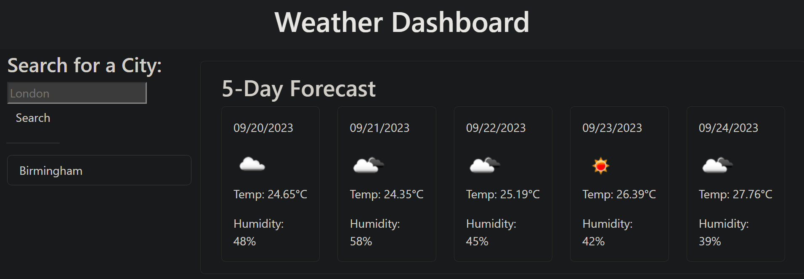

# Weather Dashboard
A simple weather dashboard application that allows users to check the current weather and the 5-day forecast for a given city.

## Deployed Link
https://lunar-potato.github.io/weather-dashboard/

## Features
- A weather dashboard that displays current weather conditions for a city which incldues the temperature, humidity, and wind speeds.
- Displays a 5-day forecast on the selected city.
- Maintains a search history for easy access to previously searched cities. 

## Getting Started
Click on the deployed link to access the weather dashboard! 

## Usage 
1. Open web browser and access the application.
2. Search up a city that you require and click the search button.
3. Current weather and 5-day forecast will be displayed according to the selected city.
4. Click on a city in the search history to view its weather conditions again.

## API Key
You need to obtain an API key from Open Weather Map (https://openweathermap.org/api) and set it in your server's environment variables. Be sure to keep your API key secure.

## License
This project is license under the MIT License - see the [LICENSE](#license) file for more details.